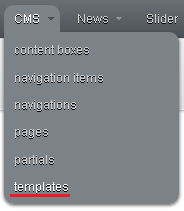
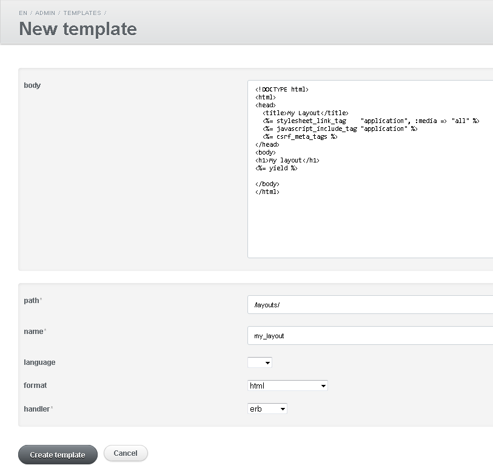
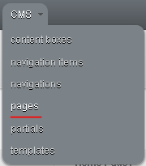
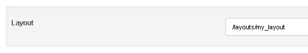

# FAQ

## How do I create a new layout?

To create a new layout, you need to save it as a template in the /layouts/ path.

Step my step instructions:

### 1. Chose 'templates' from the admin area:



### 2. Click 'New template':


### 3. Add the template body and settings:



### 4. Click 'Create template':


## How do I use a specific layout for a page?

To use a specific layout for a page, you need to specify its name in the settings.

Step my step instructions:

Assume you have the page foo.textile, and you want it to use the layout 'my_layout':

### 1. Go to the page and edit it:




### 2. Change the layout to 'my_layout'




## How do I use layouts from the database?

You can follow the steps in:

  * How do I create a new layout?
  * How do I use a specific layout for a page?

Please note following things:

You need to be using version 1.0.3.pre or greater.

You need to include the template resolver in the application controller to do this:

```
# app/controllers/application_controller.rb
class ApplicationController < ActionController::Base
  include Ecm::Cms::ControllerExtensions::TemplateResolver
  ...
end
```