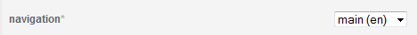
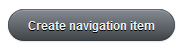
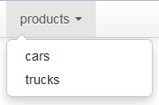

# FAQ

## How do I create a new layout?

To create a new layout, you need to save it as a template in the /layouts/ path.

Step my step instructions:

### 1. Chose 'templates' from the admin area:


### 2. Click 'New template':


### 3. Add the template body and settings:


### 4. Click 'Create template':


## How do I use a specific layout for a page?

To use a specific layout for a page, you need to specify its name in the settings.

Step my step instructions:

Assume you have the page foo.textile, and you want it to use the layout 'my_layout':

### 1. Go to the page and edit it:


### 2. Change the layout to 'my_layout'


## How do I use layouts from the database?

You can follow the steps in:

  * How do I create a new layout?
  * How do I use a specific layout for a page?

Please note following things:

You need to be using version 1.0.3.pre or greater.

You need to include the template resolver in the application controller to do this:

```
# app/controllers/application_controller.rb
class ApplicationController < ActionController::Base
  include Ecm::Cms::ControllerExtensions::TemplateResolver
  ...
end
```

## How do I create a navigation with a drop-down menu?

You can follow the steps in:

  * How do I create a nested sub-navigation item?
  * How do I set the navigation level to get a drop-down navigation?


## How do I create a nested sub-navigation item?

Assuming you have a navigation "main (en)", and a navigation item "products". And you want a new sub-item called "cars":

### 1. Chose 'navigation items' from the admin area:


### 2. Click 'New navigation item':


### 3. Select "main (en)" from navigations:



### 4. Select "products" as parent item:


### 5. Create the navigation item:




## How do I set the navigation level to get a drop-down navigation?

Setting the navigation level is done in the layout. Assume you have a navigation "main (en)" with following structure:

* products
    * cars
    * trucks

If you want to show a drop down menu with the second level of the navigation, you have to set the level option:

```
# layouts/frontend.html.erb
...
<%= cms_render_navigation :main, :expand_all => true, :renderer => :bootstrap, :level => 1..2 %>
...
```

This will give you a nice drop down menu:

